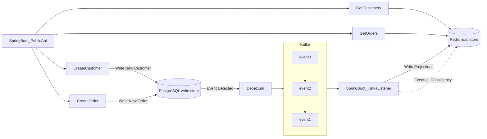

# java springboot cqrs architecture

### Abstract

Este proyecto es una aplicación desarrollada en Java con el framework Spring Boot utilizando la arquitectura CQRS (Command Query Responsibility Segregation). La arquitectura CQRS permite separar las operaciones de escritura (comandos) y lectura (consultas) en diferentes modelos de objetos y bases de datos, lo que puede mejorar la escalabilidad y la flexibilidad de la aplicación.

La aplicación incluye un conjunto de endpoints RESTful que se pueden consumir desde un cliente externo, los cuales permiten realizar operaciones de escritura y lectura en la aplicación.

Este proyecto se puede utilizar como base para desarrollar aplicaciones de diferentes tipos y escalas utilizando la arquitectura CQRS.

### Objetivos

El objetivo de este proyecto es proporcionar una arquitectura de sistema adecuada para aplicaciones que requieran una alta escalabilidad y un alto rendimiento. Para ello, se ha utilizado la arquitectura CQRS (Command Query Responsibility Segregation) en conjunto con una arquitecura hexagonal usando PostgreSQL como base de datos relacional para las escrituras y Redis, una base de datos en memoria, para las lecturas.

Además, se ha implementado una integración con Debezium para transmitir eventos a Kafka cada vez que se escriba en la base de datos PostgreSQL. De esta manera, se puede tener una visibilidad en tiempo real de las operaciones de escritura en la base de datos y proveer de un mecanismo para solventar la consistencia eventual en la base de datos de lectura.

### Definiciones y Acrónimos

- **CDC:** CDC (Capture Data Change) es una técnica que permite capturar los cambios en las bases de datos en tiempo real, lo que permite tener una visibilidad de los cambios que se están produciendo en la base de datos. Esto es especialmente útil en entornos donde se requiere una alta disponibilidad de los datos y una respuesta inmediata ante los cambios en los mismos. Como dato interesante, CDC es una buena estrateg+ia cuando se quiere integrar aplicaciones legacy con aplicaciones modernas.

- **Debezium:** Debezium es una herramienta open source que permite capturar los cambios en las bases de datos en tiempo real y transmitirlos a sistemas de mensajería como Kafka. De esta forma, se puede tener una visibilidad en tiempo real de los cambios en la base de datos y reaccionar de manera inmediata ante ellos. Se lanzó en 2016 y actualmente es compatible con los siguientes DBMS: MySQL, PostgreSQL, MongoDB, SQL Server, Oracle e IBM Db2.

- **Kafka:** Kafka es una plataforma de streaming de datos open source que permite la transmisión de mensajes de manera rápida y confiable a través de diferentes sistemas. Permite la integración de diferentes fuentes de datos y la transmisión en tiempo real de los mismos a diferentes destinos, lo que la hace especialmente útil en entornos de big data y análisis en tiempo real.

- **PostgreSQL:** PostgreSQL es un sistema de gestión de bases de datos relacional open source que se destaca por su escalabilidad y fiabilidad.

- **Redis:** Redis es una base de datos en memoria open source.

### Arquitectura propuesta

### Infraestructura

La aplicación requiere de ciertos servicios para poder funcionar correctamente como las bases de datos, el conector de debezium y el message broker que en este caso es kafka. Dichos servicios están definidos usando docker-compose.

